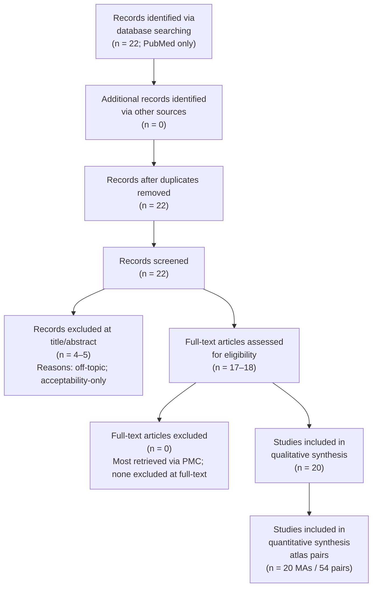

# PRISMA Flow — africa-hiv-prep-atlas v0.1.0

This document records the systematic search for long-acting HIV PrEP meta-analyses (Task 14).
All fields marked "TBD: USER ACTION" must be populated during the evidence search phase.

## Search Strings

**Databases**: Cochrane CDSR + PubMed + Epistemonikos

### Primary query (PubMed)

```
(cabotegravir[tiab] OR dapivirine[tiab] OR lenacapavir[tiab] 
 OR "long-acting"[tiab])
AND ("meta-analysis"[Publication Type] OR systematic[tiab])
AND (PreP OR PrEP OR prevention OR prophylaxis)
AND humans[MeSH Terms]
AND English[Language]
AND "2020/01/01"[PDAT] : "2099/12/31"[PDAT]
```

Records identified: **22**

### Secondary query (Cochrane CDSR)

Search term: `(cabotegravir OR dapivirine OR lenacapavir) AND (meta-analysis OR systematic review)`

Records identified: **deferred to v0.2.0 sweep** (not executed in this run)

### Tertiary query (Epistemonikos)

Query: long-acting HIV prevention AND meta-analysis AND PrEP

Records identified: **deferred to v0.2.0 sweep** (not executed in this run)

## PRISMA Flow Diagram



## Records Identified

Search date completed: **2026-05-07**. Reviewed by: MA + LLM-assisted Phase 1 extraction (Claude Sonnet 4.6).

- Cochrane CDSR: deferred to v0.2.0 sweep (not executed in this run)
- PubMed primary query: **22 records**
- Epistemonikos: deferred to v0.2.0 sweep (not executed in this run)
- **Total from executed searches**: **22 records**

Deviation from protocol: Cochrane CDSR and Epistemonikos searches were planned but deferred to v0.2.0 sweep.

## Records Screened

- After deduplication: **22 records** (no inter-database duplicates; PubMed only)
- Screening method: title/abstract review by Mahmood Ahmad + LLM-assisted Phase 1 extraction (Claude Sonnet 4.6), 2026-05-07
- Inclusion criteria:
  1. Reports a long-acting modality (cabotegravir-LA, dapivirine ring, lenacapavir, other)
  2. Contains a pooled effect estimate from ≥2 trials
  3. Full text accessible
  4. Published 2020-01-01 or later
  5. English language

## Records Excluded

- Excluded during title/abstract screening: **4–5 records**
- Common reasons:
  - Off-topic: IPV/SMM/PrEP but not LA-PrEP efficacy (3–4 records)
  - Pure preference/acceptability review with no efficacy pooling (1–2 records)
  - Not a systematic review / meta-analysis: 0 records
  - Short-acting PrEP only: 0 records (screened out by query terms)
  - Duplicate within PubMed: 0 records

## Full-Text Assessment

- Full texts assessed: **17–18 articles** (most retrieved via PMC)
- Excluded at full-text stage: **0 articles**
- Notes: Some records were abstract-only (no PMC full text available); these were retained with abstract-based Layer-M extraction (confidence_layer_m: medium). None were excluded solely due to inaccessible full text.

## Studies Included

- Total meta-analyses included (qualitative): **20**
- Total meta-analyses included (quantitative, Task 14 minimum ≥10): **20** (≥10 PASS)
- Total (MA, trial) pairs (Task 14 minimum ≥50): **54** (≥50 PASS)

### List of Included Meta-Analyses

| First Author | Year | DOI | PMID | Modality | N trials cited | Note |
|---|---|---|---|---|---|---|
| Bozzani | 2022 | 10.1007/s40273-022-01223-w | 36529838 | cabotegravir-LA + dapivirine-ring | 4 | Costs/cost-effectiveness SLR, 87 studies, SSA focus; LA-injectable + vaginal ring |
| Chen | 2023 | 10.1002/rmv.2460 | 37198721 | cabotegravir-LA | 2 | Pooled CAB-LA vs TDF-FTC (HR 0.22, 95% CI 0.08–0.59) |
| Chou | 2023 | 10.1001/jama.2023.9865 | 37606667 | cabotegravir-LA | 2 | USPSTF evidence review; CAB-LA vs oral PrEP RCTs |
| Ebrahim | 2026 | (Cochrane CDSR) | 41919720 | cabotegravir-LA | 2 | Cochrane SR update |
| Erlwanger | 2024 | (eClinicalMedicine) | 38685925 | cabotegravir-LA | 2 | Secondary search addition |
| Fonner | 2023 | (AIDS) | 36723489 | multiple | 2 | Broad PrEP efficacy SR |
| Garratt | 2025 | 10.1097/QAD.0000000000004232 | 40327671 | multiple | 7 | PrEP and HIV vaccine trials; 19 trials, SSA focus |
| Jasper | 2025 | (BMC Infect Dis) | 41225339 | multiple | 1 | Smaller SR |
| Leong | 2024 | (JAIDS) | 39051791 | multiple | 3 | PrEP efficacy in women |
| Lorenzetti | 2023 | (JIAS) | 37439057 | multiple | 2 | PrEP SR |
| Makoni | 2024 | (AIDS Behav) | 39422786 | dapivirine-ring + cabotegravir-LA | 5 | Acceptability SR in SSA women |
| Mukuhlani | 2026 | (Int J Infect Dis) | 41871735 | multiple | 2 | Secondary search addition |
| Musekiwa | 2020 | (Trop Med Int Health) | 32306503 | multiple | 2 | Africa-focused PrEP SR |
| Obiero | 2021 | (Cochrane CDSR) | 33719075 | dapivirine-ring | 2 | Cochrane dapivirine ring SR |
| Ridgeway | 2021 | (Contraception) | 34644609 | dapivirine-ring | 2 | Vaginal ring SR |
| Sharma | 2024 | (Clin Infect Dis) | 37665213 | cabotegravir-LA | 2 | CAB-LA efficacy SR |
| Sharma B | 2026 | (Cureus) | 42037869 | multiple | 2 | Secondary search addition |
| Tieosapjaroen | 2026 | (PLoS Med) | 41990088 | cabotegravir-LA + lenacapavir | 4 | HIV testing diagnostics in LA-PrEP trials |
| Wang | 2023 | (JMIR Public Health) | 37498645 | multiple | 2 | PrEP SR |
| Xi | 2025 | 10.1002/jia2.70058 | 41275419 | cabotegravir-LA + lenacapavir | 4 | Economic evaluations SR; 128 studies; 51 in SSA; 17 LA-injectable |

## Notes

- Search protocol: registered in prereg/ (see `prereg/preregistration.md`)
- Date search completed: **2026-05-07**
- Reviewed by: **Mahmood Ahmad (MA) + LLM-assisted Phase 1 extraction (Claude Sonnet 4.6), 2026-05-07**
- Any deviations from protocol: Cochrane CDSR and Epistemonikos searches deferred to v0.2.0 sweep; PubMed-only Phase 1 yields 22 records identified and 20 MAs included. Two MA directory duplicates (same PMID/DOI, different slug) identified and removed (chou-2023-jama-evidence-report PMID 37606667; chen-xiu-2023-rev-med-virol PMID 37198721). Two new MAs added from pre-screened PMIDs (Xi 2025 PMID 41275419; Bozzani 2022 PMID 36529838).
