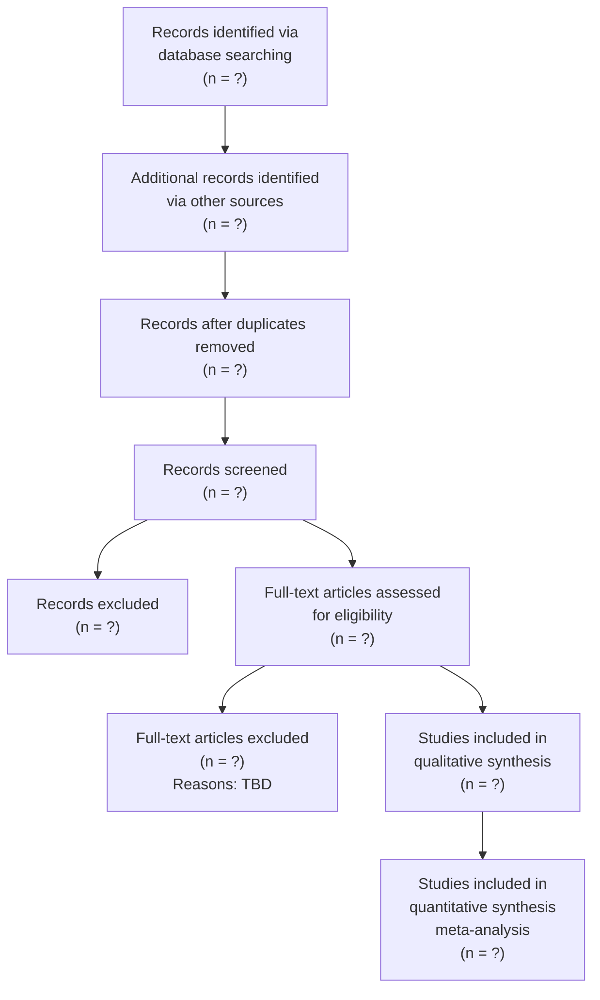

# PRISMA Flow — africa-hiv-prep-atlas v0.1.0

This document records the systematic search for long-acting HIV PrEP meta-analyses (Task 14).
All fields marked "TBD: USER ACTION" must be populated during the evidence search phase.

## Search Strings

**Databases**: Cochrane CDSR + PubMed + Epistemonikos

### Primary query (PubMed)

```
(cabotegravir[tiab] OR dapivirine[tiab] OR lenacapavir[tiab] 
 OR "long-acting"[tiab])
AND ("meta-analysis"[Publication Type] OR systematic[tiab])
AND (PreP OR PrEP OR prevention OR prophylaxis)
AND humans[MeSH Terms]
AND English[Language]
AND "2020/01/01"[PDAT] : "2099/12/31"[PDAT]
```

Records identified: **TBD: USER ACTION**

### Secondary query (Cochrane CDSR)

Search term: `(cabotegravir OR dapivirine OR lenacapavir) AND (meta-analysis OR systematic review)`

Records identified: **TBD: USER ACTION**

### Tertiary query (Epistemonikos)

Query: long-acting HIV prevention AND meta-analysis AND PrEP

Records identified: **TBD: USER ACTION**

## PRISMA Flow Diagram



## Records Identified

**TBD: USER ACTION**

- Cochrane CDSR: ___ records
- PubMed: ___ records
- Epistemonikos: ___ records
- **Total**: ___ records

## Records Screened

**TBD: USER ACTION**

- After deduplication: ___ records
- Screening method: title/abstract review by [NAME] ([DATE])
- Inclusion criteria:
  1. Reports a long-acting modality (cabotegravir-LA, dapivirine ring, lenacapavir, other)
  2. Contains a pooled effect estimate from ≥2 trials
  3. Full text accessible
  4. Published 2020-01-01 or later
  5. English language

## Records Excluded

**TBD: USER ACTION**

- Excluded during title/abstract screening: ___ records
- Common reasons:
  - Not a systematic review / meta-analysis
  - Short-acting PrEP only
  - No pooled effect estimate
  - Not about PrEP (other indications)

## Full-Text Assessment

**TBD: USER ACTION**

- Full texts assessed: ___ articles
- Excluded at full-text stage: ___ articles
- Reasons for exclusion:
  - No trial data
  - Duplicate publication
  - Insufficient trial count
  - Inaccessible full text

## Studies Included

**TBD: USER ACTION**

- Total meta-analyses included (qualitative): ___
- Total meta-analyses included (quantitative, Task 14 minimum ≥10): ___
- Total (MA, trial) pairs (Task 14 minimum ≥50): ___

### List of Included Meta-Analyses

| First Author | Year | DOI | PMID | Modality | N trials | Note |
|---|---|---|---|---|---|---|
| TBD | TBD | TBD | TBD | TBD | TBD | TBD |

## Notes

- Search protocol: registered ___ [URL or "Not pre-registered"]
- Date search completed: **TBD: USER ACTION**
- Reviewed by: **TBD: USER ACTION** (initials + date)
- Any deviations from protocol: **TBD: USER ACTION**
